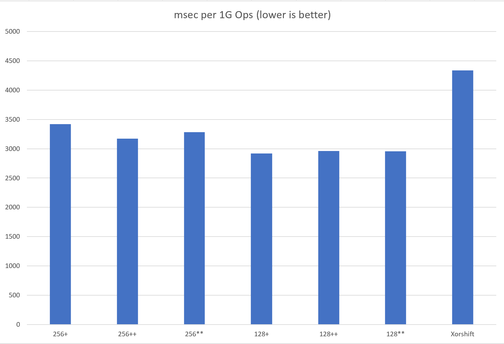

# Xoshiro

Implementation of Xoshiro pseudorandom number generators on D Programming Language.

# Usage

__Add dependency__

```
dub add xoshiro
```

__import__

```d
import xoshiro.xoshiro;

Xoshiro128Plus rndGen1;
Xoshiro128PlusPlus rndGen2;
Xoshiro128StarStar rndGen3;
Xoshiro256Plus rndGen4;
Xoshiro256PlusPlus rndGen5;
Xoshiro256StarStar rndGen6;

import std.random : uniform01, unpredictableSeed;

rndGen1.seed = unpredictableSeed;
auto x = uniform01(rndGen1);

rndGen4.seed = unpredictableSeed!ulong;
auto y = uniform01(rndGen4);
```

# Benchmark



```
cd examples/basic
dub run --build=release-nobounds --compiler=ldc2
```

# License

This library is under the MIT License.  

# See Also

https://prng.di.unimi.it